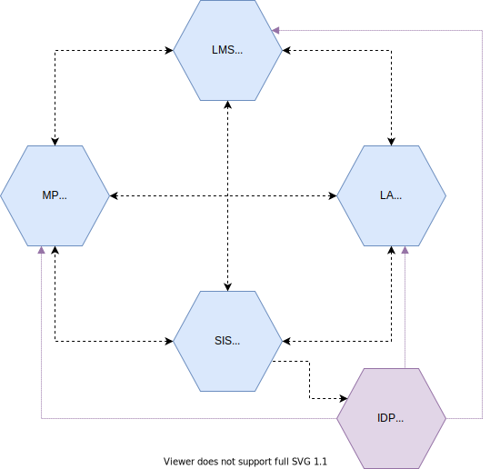

# Services

Services are provided to enable the roles to carrying out the processes.  The services communicate directly with each other, under the direction and control of the school (where appropriate). Note that schools can select multiple of these services, so multiple Learning Applications, multiple Learning Management Systems, multiple Marketplaces and even multiple School Information Systems. Next to that schools can also omit one or more of these services. In theory the smallest set might be a single Marketplace and a single Learning Application.

