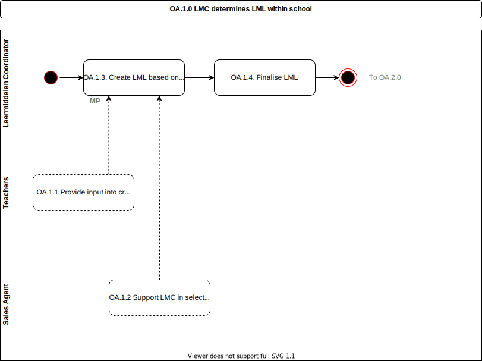

# OA.1.0 LMC determines LML within school

The process by which the [LMC](../roles/lmc.md) determines the material available to be used during the school year (mandatory and optional). Note the iterative process of creating an [LML](../glossary.md) is not described and provided as a given here.

## Roles Involved

  - [LMC](../roles/lmc.md)
  - [Users](../roles/user.md) [Teachers]
  - [Sales Agent](../roles/sales-agent.md)

## Preconditions

  - The school has selected one or more Marketplaces to be a provider of learning materials and learning applications.

## Basic Flow of Events

1. Teachers have visibility of possibly available material.	School Catalogue  (i.e. the catalogue selected for a school).
2. Marketplace provides tools to enable the LMC to manage the LML.
  - Inputs:
    - School Catalogue
     - Classes
     - Courses
     - Streams
  - Outputs:
    - Learning Materials List (LML)
3. When complete the Marketplace allows the LMC to finalise the LML.  Note that the LML is not at student level at this stage, but attached to groups.  The students will be able to confirm their individual selection in a later stage.
4.	The use case ends.

## Post-conditions

  - A  LML is available in the Marketplace
