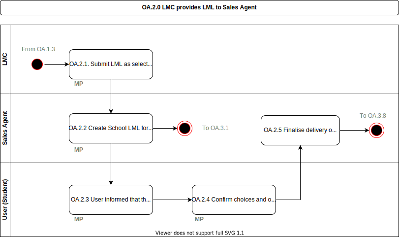

# OA.2.0 LMC provides LML to Sales Agent

Submission of the [LML](../glossary.md) as a selection of material that can be used during the school year, under any possible payment model.  This process is focused on Secondary and EBF at this stage (other processes will exist for Vocational and IBF that can be expanded on later).

## Roles Involved

  - [LMC](../roles/lmc.md)
  - [Student](../roles/buyer.md)
  - [Parent](../roles/buyer.md)
  - [Sales Agent](../roles/sales-agent.md)

## Preconditions

  - The [LMC](../roles/lmc.md) has finalised the LML

## Basic Flow of Events

1. The [LMC](../roles/lmc.md) submits the [LML](../glossary.md) as a selection for the school to the [sales agent](../roles/sales-agent.md) via the [Marketplace](../services/marketplace.md)
2. The [sales agent](../roles/sales-agent.md) can take the submitted [LML](../glossary.md) and create orders for each student (based on [SIS](../services/sis.md) data), this enables confirmation of delivery and selection of optional material.  This is based on which groups the student is a member of in the [SIS](../services/school-information-system.md) and should require no administration.
3. [Student or Parent](../roles/buyer.md) can receive notification via email, app or other mechanism.
4. Marketplace allows [Student or Parent](../roles/buyer.md) to login and confirm their order.
5. Marketplace can update the [LML](../glossary.md) for the specific [student](../roles/buyer.md) and pass the information on to fulfilment agents.

## Post-conditions

  - All [students](../roles/buyer.md) have confirmed their selections and have completed [LML](../glossary.md)
