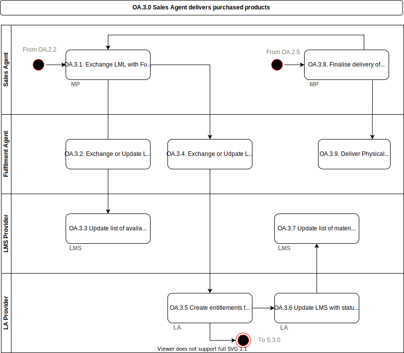

# OA.3.0 Sales Agent delivers purchased products

The sales agent delivers the products purchased through physical delivery, or integration with the [LMS](../services/learning-management-system.md) and [LA](../services/learning-application.md) to ensure that a personalised list can be created for each student and teacher.  At this stage the digital delivery can be at group level (e.g. class, course, stream) so as students arrive or change through before (or during) the school year the digital material should always be available to them.  If there are limits (e.g. 30 licenses sold and 31 students now in a group) then the decision is up to the [Learning Application Provider](../roles/learning-application-provider.md) if they allow access. Note on a pre-paid situation the delivery can still be on student level.

## Roles Involved

  - [Sales Agent](../roles/sales-agent.md)
  - [Fulfilment Agent](../roles/fulfilment-agent.md)
  - [LMS Provider](../roles/lms-provider.md)
  - [Learning Application Provider](../roles/learning-application-provider.md)

## Preconditions

  - The Sales Agent has agreements in place with the Fulfilment Agent for delivery of products.
  - A LML has been completed by the LMC, and students _may_ have selected specific material (this can also happen later).
  - Updates and changes are to be expected at any time.

## Basic Flow of Events

1. The [Sales Agent](../roles/sales-agent.md), via their [Marketplace](../services/marketplace.md), can pass on the LML to a [Fulfilment Agent](../roles/fulfilment-agent.md) so that it can be fulfilled.
2. The [Fulfilment Agent](../roles/fulfilment-agent.md) needs to ensure that the [LMS](../services/learning-management-system.md) and [Learning Applications](../services/learning-application.md) receive the parts of the LML that is applicable to them.
3. The [LMS](../services/learning-management-system.md) can use the information from the LML to create a personalised learning list for each user based on information from the SIS (Class, Group etc).
4. The [Marketplace](../services/marketplace.md) can pass on the LML to the [Learning Applications](../services/learning-application.md) (for their products only) to enable the LA to provision the entitlements needed internally and establish necessary connections to the schools systems.
5.	The [Learning Applications](../services/learning-application.md) uses the information in the LML to create internal entitlements, and trigger the [S.3.0](./s.3.0-sims-lms-learning-application-setup.md) process to connect the application to the schools SIS and [LMS](../services/learning-management-system.md) as needed.
6.  The [Learning Applications](../services/learning-application.md) provides updated information on fulfilment to the [LMS](../services/learning-management-system.md) to indicate that the product can be used.
7.  The [LMS](../services/learning-management-system.md) can update the status of the products to indicate they can now be used.
8. As the [Marketplace](../services/marketplace.md) gets updates based on personal selections (e.g. optional material) this may trigger further communication to the [Learning Applications](../services/learning-application.md) or [LMS](../services/learning-management-system.md)
9. The [Fulfilment Agent](../roles/fulfilment-agent.md) ensures delivery of any physical materials.

## Post-conditions

  - All products that have been selected by a user are available in the school [LMS](../services/learning-management-system.md) are in place
  - The connection needed between the [Learning Applications](../services/learning-application.md) and the school [SIS](../services/school-information-system.md) are in place
  - The connection needed between the [Learning Applications](../services/learning-application.md) and the school [LMS](../services/learning-management-system.md) are in place
  - All products that have been purchased by a [student](../roles/buyer.md) are provisioned in the [Learning Applications](../services/learning-application.md)

