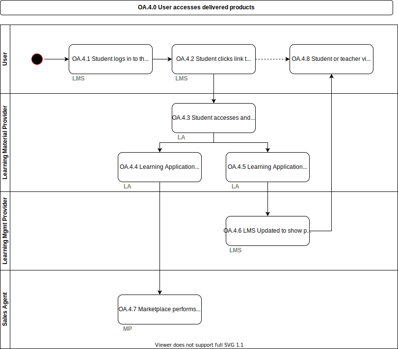

# OA.4.0 User accesses delivered products

The setup for access is now all complete, the [User](../roles/user.md) (student or teacher) will be able to click on a link within their [LMS](../services/learning-management-system.md) to access a provisioned [learning application](../services/learning-application.md).

## Roles Involved

  - [User](../roles/user.md)
  - [LMS Provider](../roles/lms-provider.md)
  - [Learning Application Provider](../roles/learning-application-provider.md)
  - [Sales Agent](../roles/sales-agent.md)

## Preconditions

  - Provisioning is complete as per [OA.3.0](./oa.3.0-sales-agent-delivers-products.md)

## Basic Flow of Events

1. [User](../roles/user.md) logs in to their [LMS](../services/learning-management-system.md) and sees personalised list of material
2. [User](../roles/user.md) clicks link to [learning application](../services/learning-application.md)
3. [User](../roles/user.md) accesses and uses the [learning application](../services/learning-application.md) after the [learning application](../services/learning-application.md) checks entitlement
4. [Learning application](../services/learning-application.md) sends information on usage to [Marketplace](../services/marketplace.md) to enable post pay models to exist
5. [Learning application](../services/learning-application.md) sends information on usage and results to [LMS](../services/learning-management-system.md) to show progress of [User](../roles/user.md)
6. [LMS](../services/learning-management-system.md) Updated to show progress of [User](../roles/user.md)
7. [Marketplace](../services/marketplace.md) performs any post-pay related billing related to usage back to the school
8. Student or teacher view results and progress in the [LMS](../services/learning-management-system.md), with further insights available in the [learning application](../services/learning-application.md)
## Post-conditions

  - [User](../roles/user.md) has been able to access selected [learning application](../services/learning-application.md) without issue or administration
  - Progress of a user in a [learning application](../services/learning-application.md)is visible in the [LMS](../services/learning-management-system.md)
  - Access is granted upfront for post pay models with the [Marketplace](../services/marketplace.md) settling any outstanding finances

