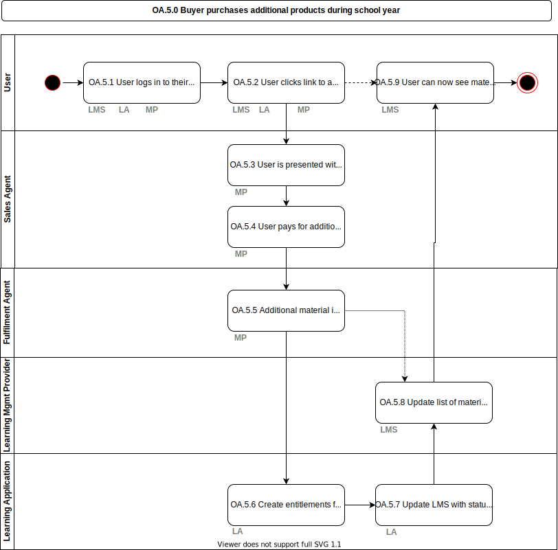

# OA.5.0 Buyer purchases additional products during school year

This model enables buyers to purchase additional material at any time during the school year (administrator, LMC, teacher, student or parent).  This also enables any of the participants (e.g. the Learning Mgmt Provider or the Learning Application Provider) to also trigger an additional purchase event and direct the user to a Marketplace used by the school to complete the transaction (if needed).

_This is just one example of potentially many flows that could occur related to optional or additional material purchased or accessed during the school year._

## Roles Involved

  - [User](../roles/user.md)
  - [LMS Provider](../roles/lms-provider.md)
  - [Learning Application Provider](../roles/learning-application-provider.md)
  - [Sales Agent](../roles/sales-agent.md)
  - [Fulfilment Agent](../roles/fulfilment-agent.md)

## Preconditions

  - Provisioning is complete as per [OA.3.0](./oa.3.0-sales-agent-delivers-products.md)

## Basic Flow of Events

### Scenario: Initiated from LMS

1. [User](../roles/user.md) logs in to their [LMS](../services/learning-management-system.md) and sees additional [learning application](../services/learning-application.md) or material that can be purchased
2. [User](../roles/user.md) clicks link to access additional [learning applications](../services/learning-application.md) or material
3. [User](../roles/user.md) is presented with payment options by the [Marketplace](../services/marketplace.md)
4. [User](../roles/user.md) pays for additional [learning applications](../services/learning-application.md) or material and an order is created for school or individual
5. The purchased [learning application](../services/learning-application.md) or material is passed from the [Sales Agent](../roles/sales-agent.md), to the [Fulfilment Agent](../roles/fulfilment-agent.md) and then finally the [learning application](../services/learning-application.md) and [LMS](../services/learning-management-system.md).  This is the same data exchange as in [oa.3.0](./oa.3.0-sales-agent-delivers-products.md).
6. [Learning application](../services/learning-application.md) creates entitlements for selected [learning applications](../services/learning-application.md) based on order from MP
7. [Learning application](../services/learning-application.md) updates [LMS](../services/learning-management-system.md) with status of product entitlement
8. [LMS](../services/learning-management-system.md) has updated list of [learning applications](../services/learning-application.md) available to learners
9. [User](../roles/user.md) can now see the [learning application](../services/learning-application.md) is purchased and access it from [LMS](../services/learning-management-system.md)

## Post-conditions

  - [User](../roles/user.md) has been able to access additional [learning application](../services/learning-application.md) without any further administration
