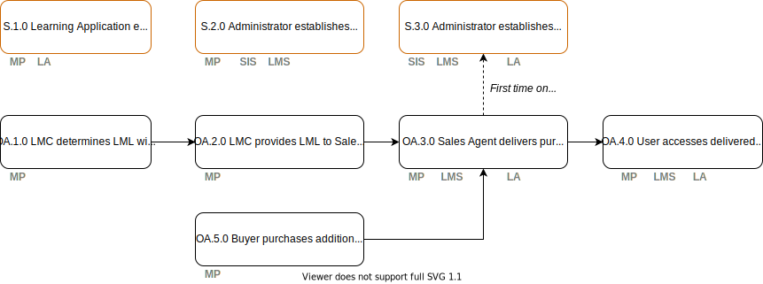

# Use Cases

Description of a smaller step within a process to allow for functional and technical design, testing and validation.

## Setup Use Cases

  - [S.1.0 Learning Application establishes relationship with Sales Agent](./s.1.0-learning-application-sales-agent.md)
  - [S.2.0 Administrator establishes relationship between SIS, LMS and Marketplace](./s.2.0-sims-lms-marketplace-setup.md)
  - [S.3.0 Administrator connects purchased Learning Application, SIS and LMS](./s.3.0-sims-lms-learning-application-setup.md)

## Selection, Delivery and Access Use Cases

  - [OA.1.0 LMC determines LML within school](./oa.1.0-lmc-determines-lml.md)
  - [OA.2.0 LMC provides LML to Sales Agent](./oa.2.0-lmc-lml-to-sales-agent.md)
  - [OA.3.0 Sales Agent delivers purchased products](./oa.3.0-sales-agent-delivers-products.md)
  - [ OA.4.0 User accesses delivered products](./oa.4.0-user-accesses-delivered-products.md)
  - [OA.5.0 Buyer purchases additional products during school year](./oa.5.0-buyer-purchases-additional-products.md)
