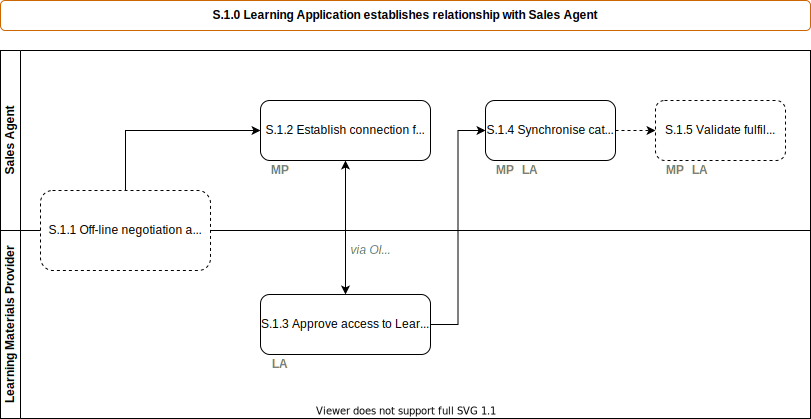

# S.1.0 Learning Application establishes relationship with Sales Agent

This is a process that occurs only once, when a [Learning Application](../services/learning-application.md) provider establishes a commercial relationship with a [Marketplace](../services/marketplace.md). The [Marketplace](../services/marketplace.md) will identify itself and request catalogue information from the [Learning Application](../services/learning-application.md), with the Catlaogue response products can be sold through the [Marketplace](../services/marketplace.md).

## Roles Involved

  - [Administrator](../roles/administrator.md) [of [Marketplace](../services/marketplace.md)]
  - [Administrator](../roles/administrator) [of [Learning Application](../services/learning-application.md)]

## Preconditions

  - A commercial agreement is in place between the [Learning Application](../services/learning-application.md) and the [Marketplace](../services/marketplace.md) owner

## Basic Flow of Events

### Scenario:  Marketplace initiated

 1. The use case begins when an [Administrator](../roles/administrator.md), initiates the setup from within the [Marketplace](../services/marketplace.md) to add a new [Learning Application](../services/learning-application.md)
 2.	The [Administrator](../roles/administrator.md) creates an entry for the [Learning Application](../services/learning-application.md)
 3.	The [Administrator](../roles/administrator.md) adds API credentials provided by the [Learning Application](../services/learning-application.md)
 4.	The [Marketplace](../services/marketplace.md) can now request catalogue information from the [Learning Application](../services/learning-application.md).

## Post-conditions

  - [Learning Application](../services/learning-application.md) products are available in [Marketplace](../services/marketplace.md) for sale
  - [Marketplace](../services/marketplace.md) can send a fulfilment request to the [Learning Application](../services/learning-application.md)
