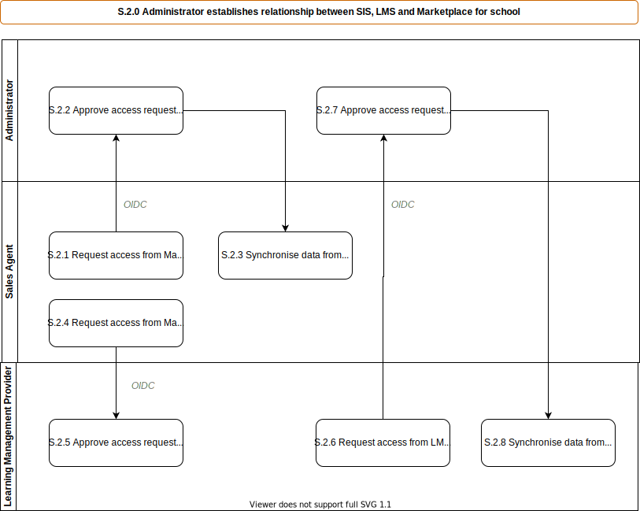

# S.2.0 Administrator establishes relationship between SIS, LMS and Marketplace

Establish the connections between the [SIS](../services/school-information-system.md), the [Marketplace](../services/marketplace.md) and the [LMS](../services/learning-management-system.md) used within a school (done only when these systems change or new services are added).

_Note this is three separate processes grouped together below for convenience, it may make sense to break them out as we add detail on the solutions._

## Roles Involved

  - [Administrator](../roles/administrator.md) [of [Marketplace](../services/marketplace.md)]

## Preconditions

  - A commercial agreement is in place between the school and the [Marketplace](../services/marketplace.md)
  - The school has a [SIS](../services/school-information-system.md)
  - The school has one or more [LMS](../services/learning-management-system.md)

## Basic Flow of Events

1. [Administrator](../roles/administrator.md) initiates the setup from within the [Marketplace](../services/marketplace.md) to add a new connection to a [SIS](../services/school-information-system.md).
2. [SIS](../services/school-information-system.md) allows an [Administrator](../roles/administrator.md) to approve a request for API access.
3. The Marketplace can now synchronise data from [SIS](../services/school-information-system.md).
4. [Marketplace](../services/marketplace.md) allows an [Administrator](../roles/administrator.md) to create a connection to a schools [LMS](../services/learning-management-system.md)
5. [LMS](../services/learning-management-system.md) allows an [Administrator](../roles/administrator.md) to approve a request for API access.
6. The Marketplace can now communicate with the [LMS](../services/learning-management-system.md).
7. [LMS](../services/learning-management-system.md) allows an [Administrator](../roles/administrator.md) to create a connection to a [SIS](../services/school-information-system.md).
8. [SIS](../services/school-information-system.md) allows an [Administrator](../roles/administrator.md) to approve a request for API access.
9. [LMS](../services/learning-management-system.md) can now retrieve data from [SIS](../services/school-information-system.md)

## Post-conditions

  - Connections are made between [SIS](../services/school-information-system.md), [Marketplace](../services/marketplace.md) and [LMS](../services/learning-management-system.md)
  - [Marketplace](../services/marketplace.md) and [LMS](../services/learning-management-system.md) can use data from [SIS](../services/school-information-system.md)
