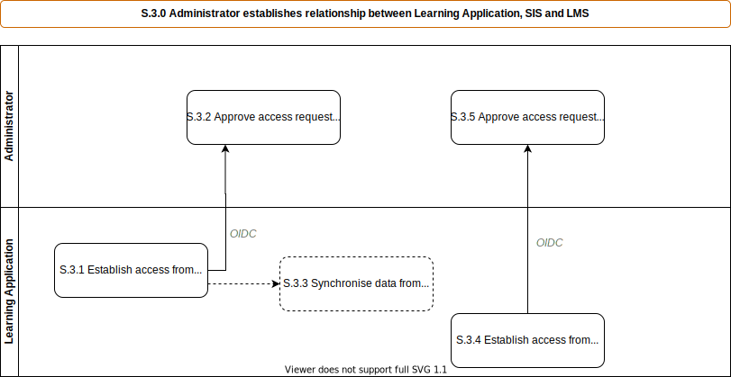

# S.3.0 Administrator connects purchased Learning Application, SIS and LMS

Establish the connections between the [SIS](../services/school-information-system.md), the [LMS](../services/learning-management-system.md) and the [Learning Appication](../services/learning-application.md) that has just been purchased.  This occurs the first time a school uses a [Learning Appication](../services/learning-application.md) from a specific [learning application provider](../roles/learning-application-provider.md), **not** for each product from that [learning application provider](../roles/learning-application-provider.md).

_Note this is three separate processes grouped together below for simplicity._

## Roles Involved

  - [Administrator](../roles/administrator.md)

## Preconditions

  - The school has a configured [SIS](../services/school-information-system.md) and [LMS](../services/learning-management-system.md) that have been connected together as per [s.1.0](./s.2.0-sims-lms-marketplace-setup.md)

## Basic Flow of Events

### Scenario: Initiated via Learning Application

1. The use case begins when [Administrator](../roles/administrator.md), initiates the setup from within the [Learning Application](../services/learning-application.md) to add a connection to a [SIS](../services/school-information-system.md)
2. [SIS](../services/school-information-system.md) allows an [Administrator](../roles/administrator.md) to approve the request for API access.
3. The [Learning Application](../services/learning-application.md) can then use the API to access data from the [SIS](../services/school-information-system.md).
4. The [Administrator](../roles/administrator.md) next initiates the setup from within the [Learning Application](../services/learning-application.md) to add a connection to an [LMS](../services/school-information-system.md)
5. [LMS](../services/learning-management-system.md) allows an [Administrator](../roles/administrator.md) to approve the request for API access.
3. The [Learning Application](../services/learning-application.md) can then use the API to access data from the [LMS](../services/learning-management-system.md).

### Scenario: Initiated via SIMS / LMS

TODO: This scenario is one where the administrator adds a service from the SIMS or LMS side, adding information provided by the learning application.

## Post-conditions

  - Connections are made between [SIS](../services/school-information-system.md), [LMS](../services/learning-management-system.md) and [Learning Application](../services/learning-application.md)
  - [Learning Application](../services/learning-application.md) can pull data from [SIS](../services/school-information-system.md) to synchronize
  - [Learning Application](../services/learning-application.md) can push updates to [LMS](../services/learning-management-system.md)
